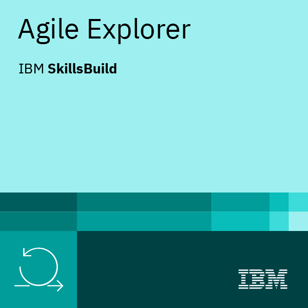
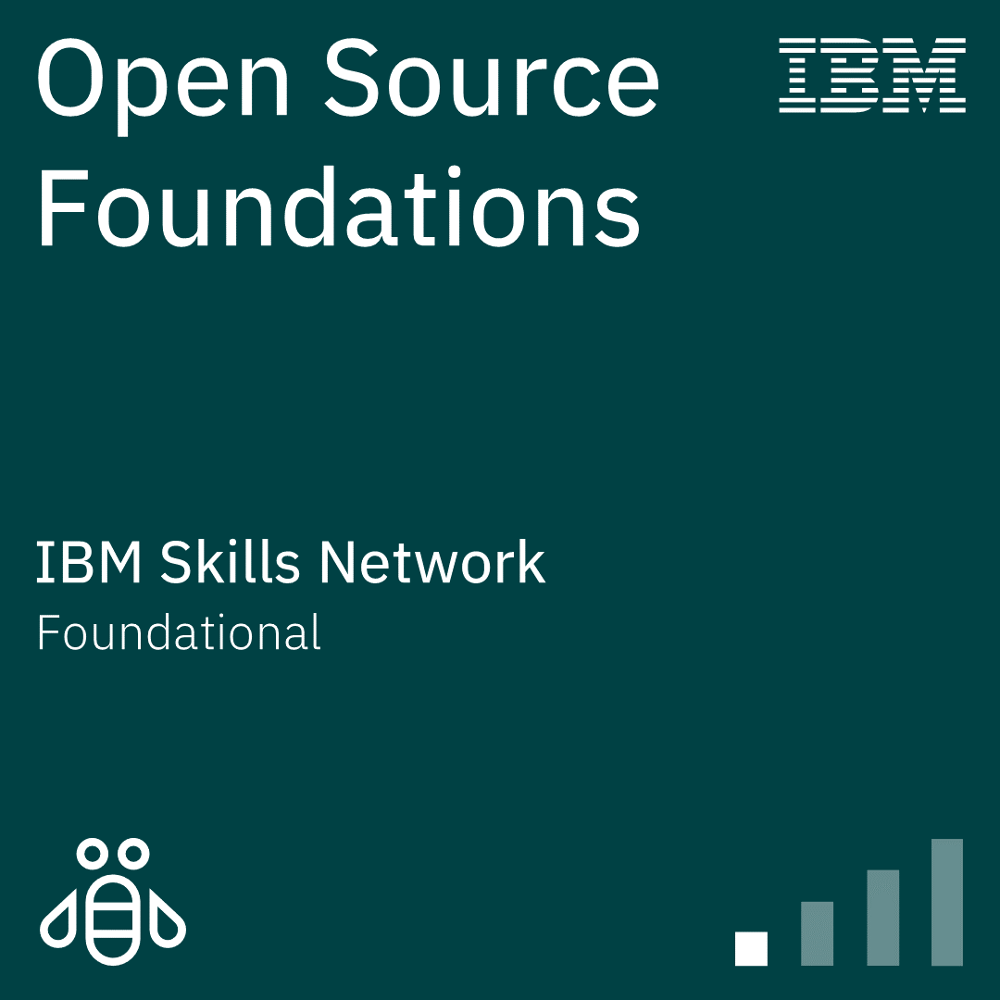

# 🎓 Holberton School France — IBM Certificates

*A collection of IBM certificates earned during the Holberton School France curriculum.*

---

## 📚 Table of Contents

- [🎯 Trimester 1](#-trimester-1)
- [📊 Progress Overview](#-progress-overview)
- [📫 Contact](#-contact)

---

## 🎯 Trimester 1

| Certificate | Platform | Skills | Preview |
|---|---|---|---|
| **Agile Explorer** | IBM SkillsBuild | • Agile Methodology • Scrum Framework • Sprint Planning • Kanban • Team Roles |  |
| **Open Source Foundations** | IBM Skills Network | • Open Source Principles • Community Collaboration • Licensing • GitHub Basics • Best Practices |  |

---

## 📊 Progress Overview

| Category | Completed | In Progress | Total |
|---|---|---|---|
| **Trimester 1** | 2 | 0 | 2 |
| **Total** | **2** | **0** | **2** |

---

## 📫 Contact

**Sagal-Louise HAIDER**

---

*Last updated: April 2026*

**Made with ❤️ by Sagal-Louise HAIDER**

